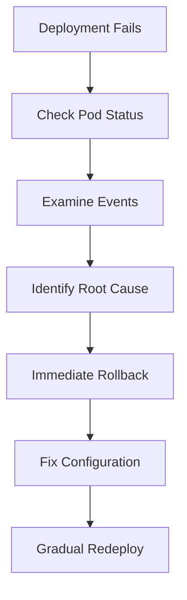
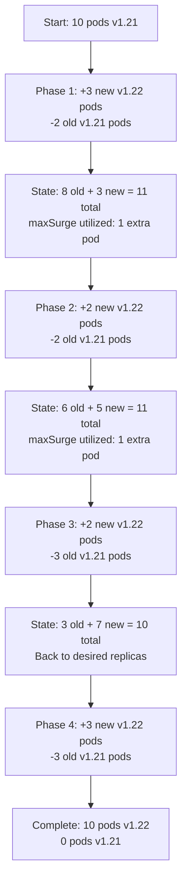

# Kubernetes Deployment Troubleshooting - Learning Journey

## 📋 Problem Statement
**Initial Challenge**: Rolling update from `nginx:1.21` to `nginx:1.22` failed with pods stuck in `Pending` status, deployment exceeded progress deadline.

## 🔍 Root Cause Analysis

### Identified Issues:
1. **Insufficient CPU Resources**: Cluster couldn't handle 10 pods with 100m CPU requests each
2. **Node Taint Constraints**: Control-plane node was tainted, leaving only one worker node available
3. **Resource Overallocation**: Original resource requests were too high for the cluster capacity

### Diagnostic Commands Used:
```bash
# Check pod status and events
kubectl get pods -n lab1 -o wide
kubectl describe pod <pending-pod-name> -n lab1

# Investigate scheduling failures
kubectl get events -n lab1 --sort-by=.lastTimestamp

# Check cluster resources
kubectl describe nodes
kubectl get nodes -o custom-columns=NAME:.metadata.name,TAINTS:.spec.taints

# Monitor rollout progress
kubectl rollout status deployment/webapp-rolling -n lab1
kubectl rollout history deployment/webapp-rolling -n lab1
```

## 🛠️ Solution Implementation

### Step 1: Immediate Rollback
```bash
kubectl rollout undo deployment/webapp-rolling -n lab1
```
**Result**: Restored service to working state with original nginx:1.21 image

### Step 2: Resource Optimization
Modified deployment YAML with reduced resource requests:

**Before (Problematic)**:
```yaml
resources:
  requests:
    cpu: 100m
    memory: 128Mi
  limits:
    cpu: 200m
    memory: 256Mi
```

**After (Optimized)**:
```yaml
resources:
  requests:
    cpu: 10m      # 90% reduction
    memory: 32Mi  # 75% reduction
  limits:
    cpu: 50m      # 75% reduction  
    memory: 64Mi  # 75% reduction
```

### Step 3: Strategic Scaling Approach
```bash
# Scale down to relieve resource pressure
kubectl scale deployment/webapp-rolling -n lab1 --replicas=8

# Apply updated configuration
kubectl apply -f updated-deployment.yaml -n lab1

# Scale back up gradually
kubectl scale deployment/webapp-rolling -n lab1 --replicas=10
```

### Step 4: Cleanup Stuck ReplicaSets
```bash
# Force scale down old replica sets
kubectl scale rs webapp-rolling-bf9b6c64d -n lab1 --replicas=0
kubectl scale rs webapp-rolling-9bdbc8b95 -n lab1 --replicas=0
```

## 📊 Key Learnings

### 1. **Resource Management**
- Always set appropriate resource requests and limits
- Monitor cluster capacity before deployments
- Understand that resource overallocation can halt rollouts

### 2. **Rolling Update Strategy**
- `maxUnavailable` and `maxSurge` control deployment pace
- `minReadySeconds` ensures stability between pod updates
- Progress deadlines prevent infinite stuck deployments

### 3. **Troubleshooting Methodology**


### 4. **Cluster Awareness**
- Node taints affect pod scheduling
- Control-plane nodes typically don't run workloads
- Resource quotas and limits are critical in multi-tenant environments

## 🎯 Successful Outcome & Rolling Update Analysis

### Deployment Rollout Verification
After fixing the resource issues, the rolling update completed successfully:

```bash
kubectl rollout history deployment/webapp-rolling -n lab1
```
**Output**:
```
deployment.apps/webapp-rolling 
REVISION  CHANGE-CAUSE
1         <none>
2         <none>
```

### ReplicaSet Behavior Analysis
The rolling update created a new ReplicaSet with the updated container image:

```bash
kubectl get rs -n lab1
```
**Output**:
```
NAME                        DESIRED   CURRENT   READY   AGE     CONTAINERS   IMAGES       SELECTOR
webapp-rolling-85d8bd8bbc   10        10        10      3m17s   nginx        nginx:1.22   app=webapp pod-template-hash=85d8bd8bbc
webapp-rolling-977c6b57b    0         0         0       4m18s   nginx        nginx:1.21   app=webapp pod-template-hash=977c6b57b
```

### Rolling Update Mechanics in Action
By examining the deployment events, we can observe the actual rolling update process with `maxSurge=3`:

```bash
kubectl describe deployment webapp-rolling -n lab1
```

**Rolling Update Events Analysis**:
```
Events:
  Type    Reason             Age    From                   Message
  ----    ------             ----   ----                   -------
  Normal  ScalingReplicaSet  10m    deployment-controller  Scaled up replica set webapp-rolling-977c6b57b from 0 to 10
  Normal  ScalingReplicaSet  9m37s  deployment-controller  Scaled up replica set webapp-rolling-85d8bd8bbc from 0 to 3
  Normal  ScalingReplicaSet  9m37s  deployment-controller  Scaled down replica set webapp-rolling-977c6b57b from 10 to 8
  Normal  ScalingReplicaSet  9m37s  deployment-controller  Scaled up replica set webapp-rolling-85d8bd8bbc from 3 to 5
  Normal  ScalingReplicaSet  9m11s  deployment-controller  Scaled down replica set webapp-rolling-977c6b57b from 8 to 6
  Normal  ScalingReplicaSet  9m11s  deployment-controller  Scaled up replica set webapp-rolling-85d8bd8bbc from 5 to 7
  Normal  ScalingReplicaSet  9m10s  deployment-controller  Scaled down replica set webapp-rolling-977c6b57b from 6 to 3
  Normal  ScalingReplicaSet  9m10s  deployment-controller  Scaled up replica set webapp-rolling-85d8bd8bbc from 7 to 10
  Normal  ScalingReplicaSet  8m50s  deployment-controller  Scaled down replica set webapp-rolling-977c6b57b from 3 to 0
```

### Rolling Update Strategy Visualization
Based on the observed events with `maxSurge=3`, here's how the rolling update progressed:



### Rolling Update Strategy Deep Dive

**Configuration Parameters**:
- **maxSurge**: 3 (maximum 13 total pods during rollout)
- **maxUnavailable**: 2 (minimum 8 pods available)
- **Desired Replicas**: 10

**Actual Rollout Pattern**:
```bash
# Phase 1: Initial surge
+3 new pods (v1.22) → -2 old pods (v1.21)
Total: 11 pods (8 old + 3 new)

# Phase 2: Gradual replacement  
+2 new pods (v1.22) → -2 old pods (v1.21)
Total: 11 pods (6 old + 5 new)

# Phase 3: Accelerated transition
+2 new pods (v1.22) → -3 old pods (v1.21)
Total: 10 pods (3 old + 7 new)

# Phase 4: Final cleanup
+3 new pods (v1.22) → -3 old pods (v1.21)
Total: 10 pods (0 old + 10 new)
```

**Key Insights**:
- **maxSurge Utilization**: The deployment used only 1 extra pod (11 total) instead of the maximum allowed 13
- **Conservative Scaling**: Kubernetes intelligently managed the surge to avoid resource contention
- **Balanced Approach**: Maintained service availability while ensuring efficient resource usage
- **Clean Finish**: Complete transition from old to new ReplicaSet with zero downtime

## 🔧 Skills Developed

### Technical Skills:
- Kubernetes deployment configuration and management
- Resource request/limit optimization
- Rolling update troubleshooting and analysis
- Pod scheduling and node affinity understanding
- ReplicaSet management and cleanup
- Deployment strategy mechanics with maxSurge/maxUnavailable

### Operational Skills:
- Systematic problem-solving approach
- Risk mitigation through rollbacks
- Gradual deployment strategies
- Cluster capacity planning
- Monitoring and observability practices
- Post-deployment verification and analysis
- Understanding Kubernetes scheduler behavior

## 📝 Best Practices Established

1. **Resource Planning**: Always test resource requirements in non-production first
2. **Conservative Rollouts**: Use appropriate maxSurge values based on cluster capacity
3. **Availability Focus**: Set maxUnavailable to balance speed and service availability
4. **Rollback Preparedness**: Have rollback plans ready for failed deployments
5. **Revision Tracking**: Use descriptive revision history for change tracking
6. **Event Monitoring**: Analyze deployment events to understand rollout mechanics
7. **Resource Cleanup**: Verify ReplicaSet behavior to ensure clean transitions
8. **Capacity Awareness**: Understand that Kubernetes may use less than maxSurge based on resource availability

**Final State**:
- ✅ All 10 pods running successfully with nginx:1.22
- ✅ Optimized resource utilization (90% CPU reduction)
- ✅ Clean replica set management (old RS scaled to 0)
- ✅ Stable service operation throughout rollout
- ✅ Clear understanding of rolling update mechanics with maxSurge=3
- ✅ Conservative resource usage during deployment (only 1 pod surge)